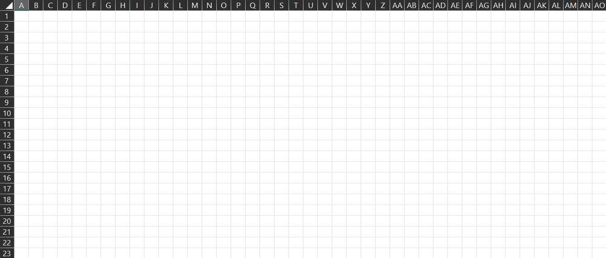

# cs312-Milestone1

## Group Project Milestone 1

In this assignment, you will begin to create a website to generate an activity called a "color coordinate" sheet.  For this first milestone, you will set up the web infrastructure to get started on the project.

## General Requirements
You will create a web page for a fictitious company, including a name and logo.  You must have some kind of navigation element that leads to the other 2 core aspects of the assignment. 

You must have an "about" page where you list the names and a brief biography of each group member. Each member of the group is required to get their name and bio onto the page, you are scored individually for having your information on the about page.  A picture or graphic avatar is required for each member of your team

Finally the heart of the assignment, the color coordinate generation page.  More details on this, below in the "Color Coordinate Generation" section

Your web page must also be styled, You will need to have at least 3 unique colors displayed on your website, NOT including pure black or white. Additionally any colors used to display text over one color or another must meet the WebAIM accessibility test, your colors chosen for displaying text or acting as a separator between two elements have a contrast value of AT LEAST 7. You can use a comment in your style sheet to include this data and can use this link to check your contrast values (https://webaim.org/resources/contrastchecker/) Links to an external site.

In General, most color palettes usually have 5-7 colors beyond pure black and white so you should try and strive for that as your target for design.

## Color Coordinate Generation
This page is the Core of the website. When the user first arrives there should be a form element that allows them to enter 3 values.

Rows
Columns
Colors
Each of these has a specific valid range. Rows has the range 1-1000 Inclusive. Columns has the range 1-702 Inclusive. Colors has the range 1-10 Inclusive.

If the user enters a value outside of the range, provide them with some form of Meaningful error message. Each data entry should be validated in all cases. Therefore up to 3 unique error messages could be displayed at any time for Rows, Columns, & Colors.

If the values pass validation, then your page will render 2 tables with the following instructions

## Table 1 - Color Selection Table
The first (upper) table is a 2 column by x row table, where x is the number of colors indicated by the parameter "colors". The left column is 20% of the table width and the right column is 80%.  The table spans most of the width of the page.  There is no header row on this table.

In this table, the left column must contain 2 elements. First is a radio button marking the row as "Selected". If any other radio buttons are selected then the currently selected one is unselected. The second element is a dropdown selector that contains a list of 10 Colors  (red, orange, yellow, green, blue, purple, grey, brown, black, teal). You may order these how you like, but try to make it as intuitive as possible. Only 1 row of this table may have any 1 color chosen at a time. Do not allow the user to select the same color more than once. When the table initially loads each row of the table should default uniquely to one of the 10 colors.

For now the Right column should be completely BLANK. You will use this in Part 2 of the Final Project.

## Table 2 - Color Painting Table
Below the first table is a table with r+1 Rows and c+1 Columns where r and c are the Rows and Columns value from the input form. The upper-leftmost corner cell is empty. The remaining Cells in the first Row are enumerated Column values using Excel Style naming. The First cell is "A" then "B" all the way to "Z" then if the user entered a value MORE than 26 the 27th column uses the name "AA" repeating until "AZ" before going to "BA" and repeating this pattern until the potential 702 Column "ZZ"

For the first column of each row you will enumerate it with its row number starting at the second row with "1". Use the below image for reference

Each of the remaining cells should be blank cells. They should support an On-Click behavior that in some way alerts the user to which cell they selected. It can be in an alert, a popup, a Console Log, or even changing the content of the cell. All this alert needs to say is the Row number and Column Label. For example if I click on the Cell in Column "AB" on Row 20 then there should be a message along the lines of "AB20"

Finally, at the bottom of the table there is a button that will allow you to print the page. The printout should look a little different. It should be rendered in Greyscale, with your company Logo in the upper left corner, and each table rendered with no selectors or dropdowns visible.

## Submission
For this assignment you will be simply submitting the URL to your team's page. Only 1 team member needs to host the assignment. Please submit the url for your Angular hosted page. Should be something like

Host-name.cs.colostate.edu:####/

We will attempt to access your team's website at that given URL. If it is down we will contact you to re-host the page so we can grade it.

## Grading Notes/Group Dynamics
Group members are expected to work together towards this common goal.  If a group is having a problem with a member, the instructor must be notified right away.

Start the assignment early and document the process. For example keep track of who worked on what parts of the assignment. I DO NOT recommend breaking down the project based on the grading rubric. Instead break it down based on individual pieces. For example have one person handle the form and create the Input/Output format for the code to pass to the other team members who are handling the tables 1 and 2.

Any conflicts on performance will need documentation of work. It is recommend your team makes a Github to share code for the project between team members and to keep a record of Pushes and Edits.

Note that documentation of work is only graded in cases where teams make claims another member is not pulling their weight of the work.

## Grading Breakdown

10 points just for turning in the assignment.
Website has a color scheme of at least 3 unique colors not including Black and White. (10 points)
Colors Displayed over each other as text or to create separation have a WebAIM contrast level of 7 or higher (10 Points)
Member Biographies (10 points) ***
Color Coordination page has input form (10 points)
Parameter Validation (10 points)
Tables generated as specified (20 points)
Color selector obeys selection restrictions (no duplicate colors, default filling of values) (10 points)
Print Button (10 points)
*** Items marked with triple stars (***) are individually graded per student.  Otherwise, all other items will be awarded points to all team members the same.  The notable exception is that team members who did nothing or significantly less work will be penalized, potentially losing all of these points in extreme cases.

Finishing the Color Coordinate Generation
Selecting a color in the upper table now marks a color as "Active". When a cell in the lower table is clicked, it is colored with the "Active" color.  

When a cell in the lower table is clicked, its coordinate is added to the right column by the color name.  For example, if cells A1, B2, and C3 are colored "red" then the row with "red" as the selected color will show "A1, B2, C3" in the right cell.  Keep the cells in lexicographic order (Sort by letter First, Number Second).  

When a drop-down is changed to a new color, all of the cells in the table change from the old color to the new color.  

Print View
Update the print view to support the new color coordinate generation.  When the form is submitted, the print view behaves as before.  Additionally, the radio buttons are NOT shown and along side the color name include the color's Hex Code.  The lower table's cells remain blank (white) and are not colored.  The right column of the upper table DOES contain the cell coordinates.

The idea here is that we have generated a "color by number" sheet, where you can make a picture in the editor, then get a print view, print it and it is an activity to be colored. 

Why did we do this?
A large part of Computer Science is helping people, improving quality of life.  These color coordinate sheets are actively used in Vision Therapy for certain vision disorders.  You just made software to help with this type of therapy!  Nice.

Database - Manage Colors
Create a new page for Color Selection. This must be separate from the color coordinates page.

On this page you will have code to allow users to enter new colors into your selection choices. 

In your database you will add a table called "colors", each row represents a unique color. The colors have an "id", "Name", and "hex value". All 3 of these are Unique and cannot be "Null"

On this page there should 3 Interfaces.

The first interface is to Add a new color, ideally the user should only have to enter a name and hex value for the color. If adding a color would conflict with an already existing name or hex value, a non-intrusive error should be displayed telling the user so.
The second interface is to allow the user to Edit an existing color. This should allow them to change the name and/or the hex value of the color. The same errors apply to the Add command.
The third interface is for deleting a color. This should allow the user to select a color, and submit it for deletion. Ensure that this is a 2 step process to prevent any accidental deletes (e.g. don't use a drop down menu that sends a delete request on click).  Additionally do not let the user submit a delete request if there are less than 2 colors in the color table. Please use a non-intrusive error to alert the user if they attempt to delete one of the last 2 colors.
Please pre-initialize your table with the 10 basic colors as per milestone 1.

Improving the Color Coordinates Page
In the Color Coordinates page there are a few new changes.

instead of having a drop down menu with 10 hard coded color choices it now has 1 choice per color in the Colors Table. The same color selection restrictions are in place, each row should be a unique color and no duplicate colors can be selected.
For input validation the user now can request between 1-N row for the color selector where N is the number of colors in your colors table. Again this can be quite unreasonable as 50 color rows would be untenable to read. However you should do your BEST to accommodate but know that when a user makes an unrealistic request sometimes the site will have unusual responses.

Final Polish
Do a final polishing pass on your site to make sure it always looks its best.  This is subjective.  Do some "hallway usability testing" on your site.  Show it to your parents, aunts, uncles, cousins, children, friends, roommates, grandparents, or whoever else will look at it.  See what they say.  You want this to be a professional looking site. 

Grading
Ability to paint with a chosen color, coordinate appears in table when painted (10 points)
Cells change colors when drop down changed (10 points)
Print view shows coordinates, no colored-in cells (10 points)
DB Access Page (10 Points)
DB table added to store colors, application pulls from table to populate drop downs (5 points)
User interface to add Colors (10) Points
User interface to delete colors (10 points)
User Interface to edit colors (5 points)
Final Polish, app is a well-polished, good looking, application without errors (30 points)
This is a large category and basically will be an overall impression of your site.  
Most of the submissions to Milestone 1 would have received 15-20 points on this (so don't stress too much!).
Features that aren't implemented won't count against, but if something is implemented, it should work nicely.